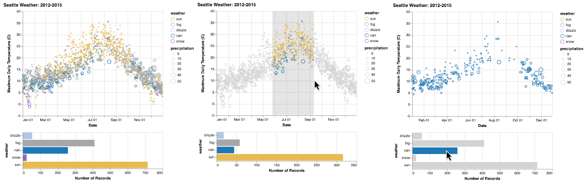

# Summary

Altair is a declarative statistical visualization library for Python.
Statistical visualization is a constrained subset of data visualization focused on the creation of visualizations
that are helpful in statistical modeling. The constrained model of statistical visualization is usually expressed
in terms of a visualization grammar [2005-grammar] that specifies how input data is transformed and mapped to visual
properties (position, color, size, etc.).

Altair is based on the Vega-Lite visualization grammar [@2017-vega-lite], which allows a wide range of statistical
visualizations to be expressed using a small number of grammar primitives. Vega-Lite implements a view composition
algebra in conjunction with a novel grammar of interactions that allow users to specify interactive charts in an few
lines of code. Vega-Lite is declarative; visualizations are specified using JSON data that follows the
[Vega-Lite JSON schema](https://github.com/vega/schema). As a Python library, Altair provides an API oriented towards
scientists and data scientists doing exploratory data analysis [@1977-exploratory]. Altair's Python API emits Vega-Lite
JSON data, which is then rendered in a user-interface such as the Jupyter Notebook, JupyterLab, or nteract using the
[Vega-Lite JavaScript library](https://vega.github.io/vega-lite/). Vega-Lite JSON is compiled to a full Vega
specification [@2016-reactive-vega-architecture], which is then parsed and executed using a reactive runtime that
internally makes use of D3.js [@2011-d3]. 

The declarative nature of the Vega-Lite visualization grammar [@2005-grammar, @2017-vega-lite], and its encoding in a
formal JSON schema, provide Altair with a number of benefits. First, much of the Altair Python code and tests are
generated from the Vega-Lite JSON schema, ensuring strict conformance with the Vega-Lite specification. Second, the JSON
data produced by Altair and consumed by Vega-Lite provides a natural serialization and file format for statistical
visualizations. This is leveraged by JupyterLab, which provides built-in rendering of these files. Third, the JSON data 
provides a clean integration point for non-programming based visualization user-interfaces such as Voyager
[@2016-voyager,@2017-voyager2].

In addition to [static documentation](https://altair-viz.github.io/), Altair includes a set of Jupyter Notebooks with
examples and an interactive tutorial. These notebooks can be read by anyone with only a web-browser through
[binder](https://mybinder.org/).

-

The example above is an interactive Altair visualization of the weather in Seattle. The plot on the *left* shows the
initial state: a scatterplot showing the temperature and dominant weather type between January and December, and a bar
chart showing the counts grouped by weather type. The plot in the *middle* shows a brush that the user has drawn to
focus on the summers; which are dominantly sunny. In the last plot on the *right*, the user has clicked on the a bar
to filter the scatterplot.

These interactions are achieved through two selections: an interval selection on the scatterplot and a multi selection
on the bar chart. The selections drive filters in the other plot. The code for this and other examples is in the
[Altair gallery](https://altair-viz.github.io/gallery/).

# Acknowledgements

We thank the many contributors that created examples, wrote documentation, and reported bugs. You can find an up-to-date
list of contributors at https://github.com/altair-viz/altair/graphs/contributors.
